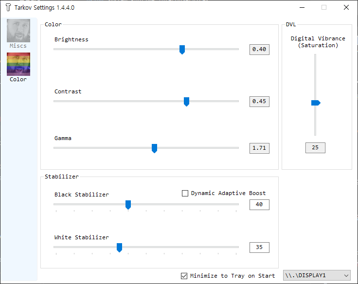

# tarkov-settings

## [->**DOWNLOAD Latest**<-](https://github.com/Perofunyang/tarkov-settings/releases/latest)

Automatically change color settings for [Escape from Tarkov](https://escapefromtarkov.com).

## How it works?
- Changes Digital Vibrance value from Nvidia Settings using [NvAPIWrapper](https://github.com/falahati/NvAPIWrapper)
- Changes Gamma using [Win32 GDI API](https://docs.microsoft.com/en-us/windows/win32/api/wingdi/nf-wingdi-setdevicegammaramp)
- Analyzes real-time screen luminance (32x32 fast sampling, < 0.5ms) for Dynamic Adaptive Boost
- Uses Win32 `EnumDisplayDevices` for instant (< 1ms) GPU vendor detection

It only changes your display's colors when Escape from Tarkov's window is in focus.
This leaves a smooth transition when minimizing/maximizing, and desktop colors remain 100% normal when EFT is unfocused or closed.

## Supported Graphic Cards
- Nvidia GPU **fully supported.** (Brightness/Contrast/Gamma/Saturation/Stabilizers)
- AMD GPU **partially supported.** (Except Saturation)
- Intel/Etc: Basic Gamma/Brightness/Contrast supported.

## What does it do?
You can change and configure any of the following settings:
1. **Brightness, Contrast, Gamma**
2. **Digital Vibrance Control** (aka. Saturation)
3. **Black Stabilizer** (Monotonic 8th-order Toe Anchor shadow boost — lifts dark shadows without washing out midtones or tone inversion)
4. **White Stabilizer** (Soft Knee Ceiling Cap highlight compression — caps blinding flashlights and NVG glare while preserving 100% midtones)
5. **Dynamic Adaptive Boost** (Real-time screen sampling with side-lighting spatial weights — automatically boosts shadow visibility when blinding lights/NVG auto-gating dim your screen)
6. **Trader/Menu UI Auto-Detection** (Automatically pauses dynamic boost while trading, in stash, or main menus)
7. **Multi-Monitor Support** (Seamlessly works on secondary/tertiary monitors)
8. **Real-time Auto-Save with Debouncing** (Settings auto-save to `settings.json` without needing to exit manually)
9. **System Tray Quick Toggle** (Right-click tray icon to toggle Dynamic Adaptive Boost instantly)

## How to Use
1. Open application (SmartGuard might prevent opening as it's not signed)
2. Adjust any color or stabilizer values
   - Double-click any slider labels to reset their values to default.
3. Check **Dynamic Adaptive Boost** if you want automatic compensation for NVG glare / flashlights during night raids.
4. Settings are **automatically saved in real-time** to `settings.json` (saved locally in app folder or `%APPDATA%\TarkovSettings`).
5. Minimize to tray and play EFT!

## Warning / Notes
1. It might blink a couple of times when activating the EFT window, but it works normally.
2. **Disclaimer: Use at your own risk. (Operates strictly at the OS/Display driver level without modifying game files/memory).**
3. AMD GPUs only support Brightness/Contrast/Gamma/Stabilizer controls.
4. Works best in **Borderless mode**.
5. Displays automatically reset to default Windows colors when Alt-Tabbing out or closing EFT.

## TODO / Feature
- [x] Process Focusing Awareness
- [x] Digital Vibrance Value Change
- [x] Gamma Value Change
- [x] Brightness, Contrast, Gamma Value modify
- [x] Black & White Stabilizers (Soft Knee Cap & Monotonic Curve)
- [x] Dynamic Adaptive Boost Engine (Side-lighting spatial weighting)
- [x] Trader/Menu UI Auto-Detection
- [x] Multi-Monitor / Secondary Display Support
- [x] GUI & Debounced Auto-Save
- [x] Portable-first JSON configuration
- [x] Process Changeability (Not only for EscapeFromTarkov)
- [x] Change display (monitor) target
- [x] Minimize to tray & Tray Context Menu Quick Toggle
- [x] Profiles
- [x] Presets
- [x] Preview
- [ ] Hot Keys
- [ ] EFT setting modify (Framelimit or Graphic Settings)

Thanks for your support!